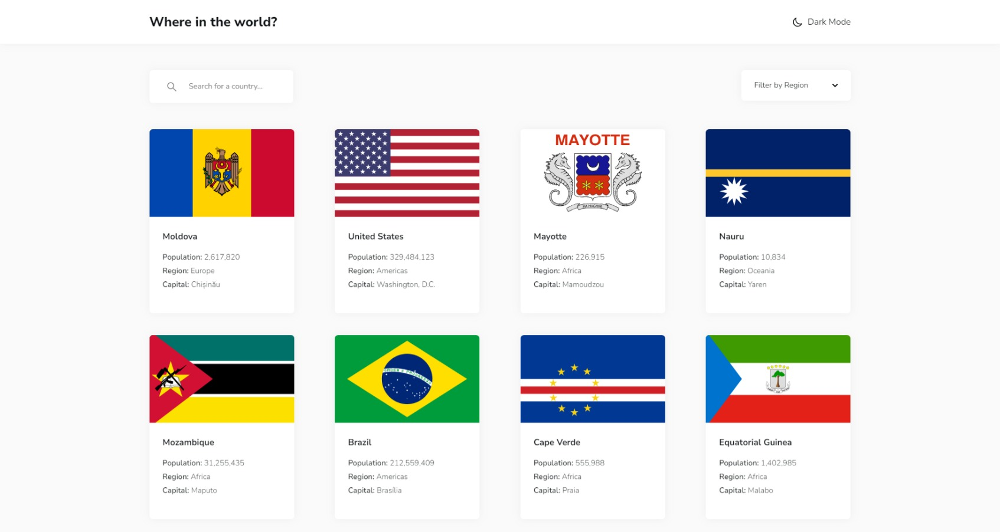
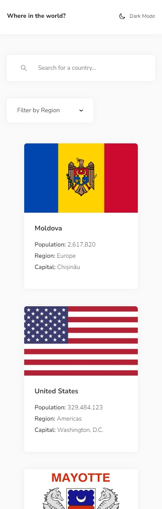
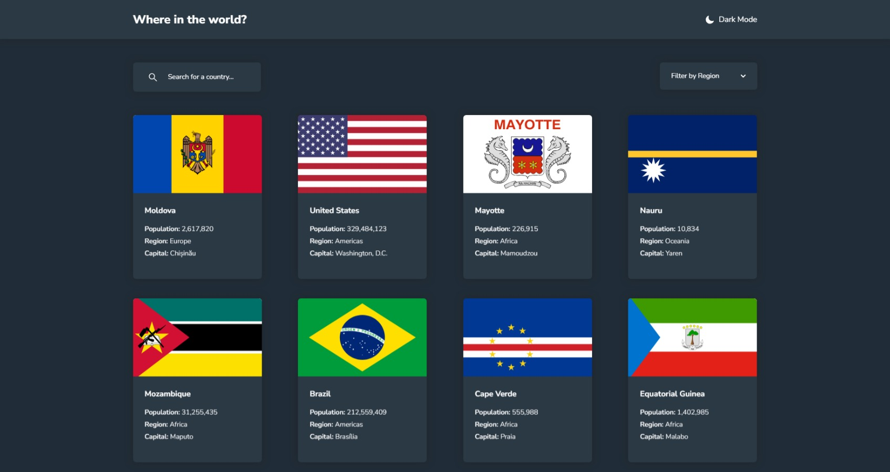
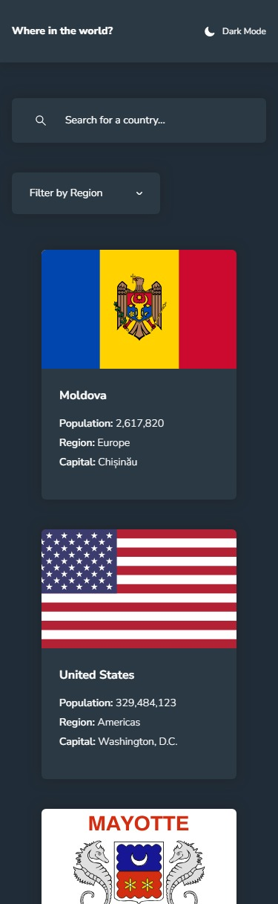
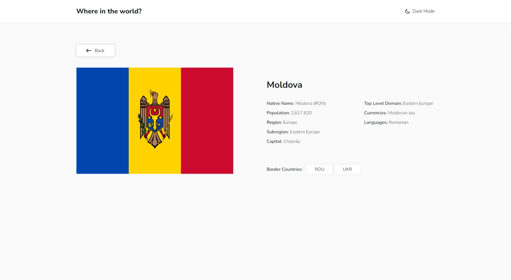
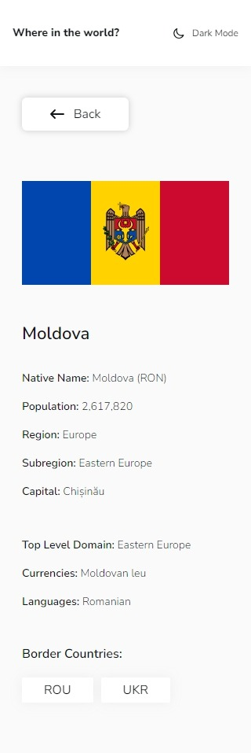
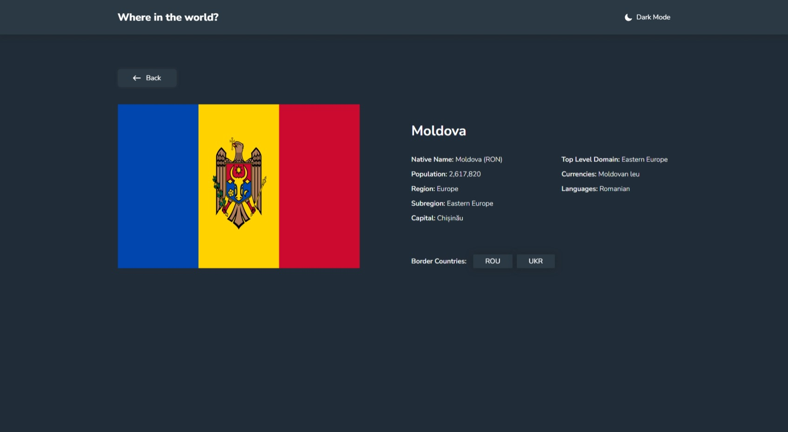
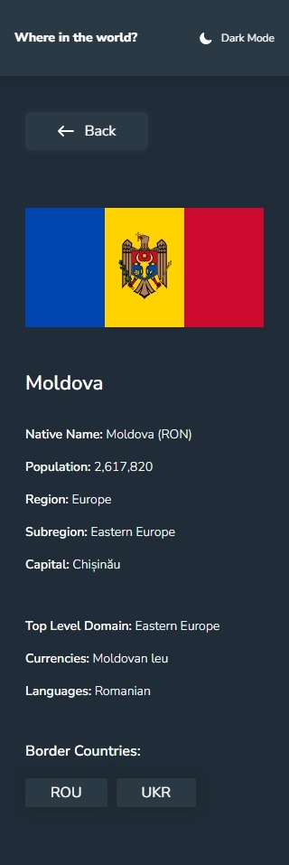

# Frontend Mentor - REST Countries API with color theme switcher solution ([🔗 Live Solution](https://anindyoo.github.io/frontend-mentor_4-rest-countries-api-challenge-solution//))

This is a solution to the [REST Countries API with color theme switcher challenge on Frontend Mentor](https://www.frontendmentor.io/challenges/rest-countries-api-with-color-theme-switcher-5cacc469fec04111f7b848ca). Frontend Mentor challenges help you improve your coding skills by building realistic projects. 

## Table of contents

- [Overview](#overview)
  - [The challenge](#the-challenge)
  - [Screenshot](#screenshot)
  - [Links](#links)
- [My process](#my-process)
  - [Built with](#built-with)  
- [Author](#author)

**Note: Delete this note and update the table of contents based on what sections you keep.**

## Overview

### The challenge

Users should be able to:

- See all countries from the API on the homepage
- Search for a country using an `input` field
- Filter countries by region
- Click on a country to see more detailed information on a separate page
- Click through to the border countries on the detail page
- Toggle the color scheme between light and dark mode *(optional)*

### Screenshot

#### 1. Home Page
##### a. Light

- Desktop

- Mobile 

##### a. Dark

- Desktop

- Mobile 

#### 2. Detail Page
##### a. Light

- Desktop

- Mobile 

##### a. Dark

- Desktop

- Mobile 

**Note: Delete this note and the paragraphs above when you add your screenshot. If you prefer not to add a screenshot, feel free to remove this entire section.**

### Links

- Solution URL: [Github](https://github.com/anindyoo/frontend-mentor_4-rest-countries-api-challenge-solution)
- Live Site URL: [Github Pages](https://anindyoo.github.io/frontend-mentor_4-rest-countries-api-challenge-solution/)

## My process

### Built with

- [REST Countries API](https://restcountries.com) - The Countries API
- Semantic HTML5 markup
- [Tailwind CSS](https://tailwindcss.com/)
- [React](https://reactjs.org/) - JS library
- [Heroicons](https://heroicons.com/) - For icons

## Author

- Frontend Mentor - [@anindyoo](https://www.frontendmentor.io/profile/anindyoo)
- Twitter - [@anindyo_](https://www.twitter.com/anindyo_)
